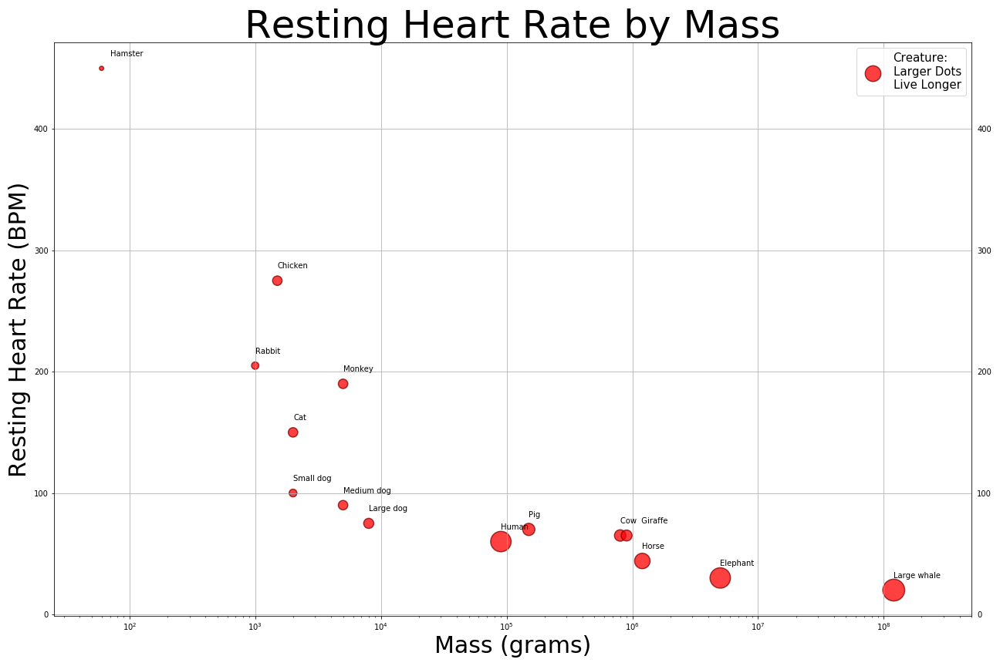
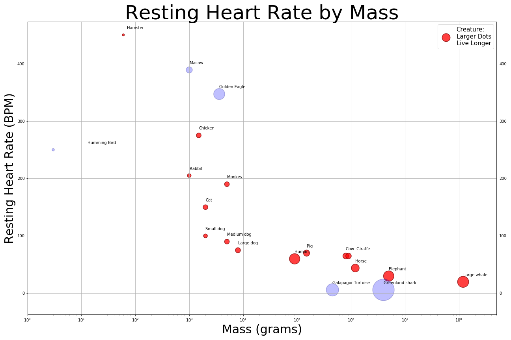

# Resting Hearth Rate by Heart Mass
# r/dataisbeautiful's DataViz Battle for August 2019

## Background
For August 2019 Reddit's r/dataisbeautiful's DataViz Battle's dataset dealt with the heart mass, resting heart rate, and lifespan of various animals. 

## Data Cleaning
The data for this set is small, and already quite organized. The only "cleaning" was combining two of the animals' names into one cell so they didn't overlap on the chart. Unfortunately that makes the .csv worthless to anything but this chart; to compensate for this problem, a copy of the raw data was added to the repo. 

## Charting
Matplotlib and Jupyter Notebook were used for the charting. Heart mass and resting heart rate showed a higer R2 value those two values got charted on the X & Y axes.  

The size of the marker is based on lifespan to show which animals live longer. While using marker size makes it difficult to see minute differences, average lifespan is impacated by many factors and the goal here to show a general trend.

There is a wide range in the data values for heart mass. Hamsters have a 60 gram heart and Large Whales have a 120,000,000 gram heart. To maeke the chart much easier to read, a log scale was used for the x-axis. This decision was a conscious choice with the r/dataisbeautiful viewership in mind; it's assumed that such viewers understand a log scale, and wasn't done "just to make the graph pretty". 

That said, the markers are red because oxygenated blood is red, hearts pump blood, and is purely just to make things pretty. As hearts pump blood, the idea of having the dots "pump" occured, but was ultimately rejected because it'd make the data more difficult to read, while adding nothing of value.

Each marker is annotated with the creature that dot represents. The dataset uses commonly known creatures and adding their names to the chart helps readers understand the trends shown. It also gives them a rough idea for comparing heart mass, heart rate, and lifespan to body mass.

## Conclusions
While there appears to be a link between both heart rates and mass with lifespan, this assesment is tenuious at best. The sample size is small and the standard deviations are high. Both the Hamster and the Large Whale are influential points increasing what was already just a moderate correlation. The project was fun, and the work is professional, but drawning concluisons from this dataset is ill advised. 

## Additional Work
After reviewing the entries from other applicants and seeing that some imply not only correlation between the variable, but causation as well, additional data was found for five more animals. This information further weakens the correlation of the data, hopefully decreasing the chance of this classic mistake. Unfortunetly this data was grabbed from various places online.

## Links
[r/dataisbeautiful DataViz Battle for August 2019](https://www.reddit.com/r/dataisbeautiful/comments/cmrz6j/battle_dataviz_battle_for_the_month_of_august/)

[Dataset of heart information](https://github.com/zonination/datasets/blob/master/file.csv)
